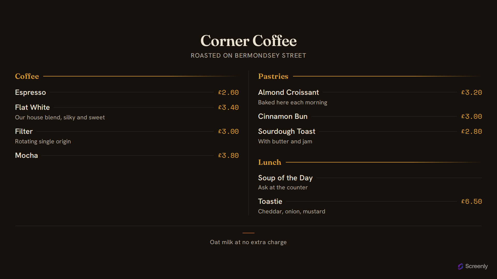

# Screenly Menu Board App

A full-screen menu board for cafes, bars and small kitchens. Items are grouped
into **sections** with prices set hard right in tabular mono, so the whole board
scans from across a room while someone is still deciding in the queue.



Live: **https://menu-board.srly.io**

Part of the Screenly signage family alongside the [opening-hours](../opening-hours),
[quotes](../quotes) and [weather](../weather-app) apps. Like Opening Hours this is
a fully **static** site on **GitHub Pages** with no server, and it is a
**settings** app: the entire menu arrives in the launch URL's query string, so one
deployment serves every venue and changing a price is a URL edit.

## How the data works

Everything is a query parameter. Each menu item is one repeated `item=` param
holding a pipe-delimited token:

```
https://menu-board.srly.io/?name=Corner+Coffee&currency=%C2%A3
  &item=Coffee|Espresso|2.60
  &item=Coffee|Flat+White|3.40|Our+house+blend,+silky+and+sweet
  &item=Pastries|Almond+Croissant|3.20|Baked+here+each+morning
  &note=Oat+milk+at+no+extra+charge
```

| Param | Meaning |
| --- | --- |
| `name` | Board title, usually the venue |
| `subtitle` | Optional line under the title |
| `currency` | Symbol prefixed to prices written as a bare number |
| `item` | One per menu item, repeated. `section\|name\|price\|description` |
| `note` | Optional line under the menu |

### The `item` token

Only **name** is required; trailing fields can be left off:

| Token | Result |
| --- | --- |
| `Coffee\|Flat White\|3.40\|Our house blend` | full form |
| `Coffee\|Espresso\|2.60` | no description |
| `Coffee\|Espresso` | no price either |
| `Espresso` | no section — lands under "Menu" |

**Sections ride on the item rather than being their own parameter.** That is
deliberate: the store serialises settings with an RFC 6570 template, which
expands each variable as its own run (`?section=A&section=B&item=…&item=…`), so
interleaved section and item params would lose their ordering the moment the
store built the URL. Sections are collected in order of first appearance, and
items sharing a section are grouped even if their params aren't adjacent.

A literal pipe inside a field is escaped as `\|`.

**Prices** written as a bare number (`3.40`) pick up `currency`. Anything else
(`$4`, `4 EUR`, `Market price`) is printed exactly as written.

Because a blank field drops *along with its separator*, a short token can have
more than one reading. Whether a field contains a digit settles it:

| Arrives as | Read as | Because |
| --- | --- | --- |
| `Cortado\|3.10` | name, price | field 2 has a digit, so there's no section |
| `Pastries\|Cinnamon Bun` | section, name | no digit |
| `Coffee\|Espresso\|2.60` | section, name, price | field 3 has a digit |
| `Lunch\|Soup\|Ask at the counter` | section, name, description | no digit |

This is only wrong for an item whose price contains no digit at all ("Market
price") *and* which omits every other optional field. Give it a description, or
write the price with a digit. The round trip is verified against the store's own
`applyItemFormat` and `buildLaunchUrl`.

Opened with no parameters (the store preview, or a bare visit) it shows a worked
example, so the board is never blank.

The [app-store manifest](.well-known/signage-app.json) declares these as typed
settings and a launch template, so the store renders the config form and builds
the URL for you — see [`docs/app-manifest.md`](../app-store/docs/app-manifest.md).

### Fitting the screen

Column count comes from the number of lines the menu has, not the viewport: a
six-line menu stays in one column even on a 4K panel, and a long one flows into
two or three (portrait tops out at two, since splitting a narrow panel early just
gives two cramped columns). Sections never split across a column break.

If a menu is long enough to overflow anyway, the board shrinks its root font-size
until it fits. Signage has no scrollbar and nobody standing there to scroll it, so
a board that overflows is a board with items missing.

## Stack

- **Bun** — package manager, bundler, and test runner (no npm/npx)
- **TypeScript** — all app JS, strict mode
- **Tailwind CSS v4** — CSS-first config (`@theme`), compiled by the Tailwind CLI
- **Biome** — lint + format
- Self-hosted variable fonts (Fraunces, Hanken Grotesk, Space Mono), vendored from `@fontsource`

## Develop

```sh
bun install        # install deps (fonts get vendored during build)
bun run dev        # build, then serve dist/ locally
bun run build      # build the static site into dist/
bun test           # run unit tests (parsing, grouping, columns, manifest)
bun run typecheck  # tsc --noEmit
bun run lint       # Biome (lint:fix / format to auto-fix)
```

`bun run build` is non-destructive: it assembles everything into `dist/`
(gitignored) — copies `index.html`, static assets and the `.well-known/`
manifest, compiles Tailwind, bundles the TypeScript, stamps a content-hash `?v=`
onto asset URLs for cache-busting, and writes the `CNAME`.

## Supported resolutions

The layout is fluid (one `clamp()`-driven root size, orientation-neutral).
Verified landscape **and** portrait across:

| Resolution | Notes |
| --- | --- |
| 4096×2160 · 3840×2160 (+ portrait) | 4K |
| 1920×1080 (+ portrait) | 1080p |
| 1280×720 (+ portrait) | 720p |
| 800×480 (+ portrait) | Raspberry Pi Touch Display |

## Deploy

Deploys are **tag-driven**. Pushing a CalVer tag (`YYYY.N`, e.g. `2026.8.0`)
runs `.github/workflows/deploy-pages.yml`, which builds and publishes `dist/` to
GitHub Pages; it can also be run by hand from the Actions tab
(`workflow_dispatch`). Pushing to `master` on its own does **not** deploy.

CI (`ci.yml`) typechecks, lints, tests and builds on every pull request.

```sh
git tag 2026.8.0 && git push origin 2026.8.0   # cut a release
```

One-time setup (outside this repo):

1. **DNS:** `CNAME` record `menu-board.srly.io → screenly-labs.github.io`.
2. **Repo → Settings → Pages:** Source = "GitHub Actions"; set the custom domain
   to `menu-board.srly.io` and enable "Enforce HTTPS" once the certificate
   provisions.

## License

AGPL-3.0-only (see `LICENSE`).
